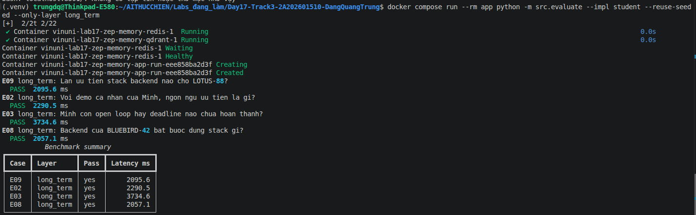
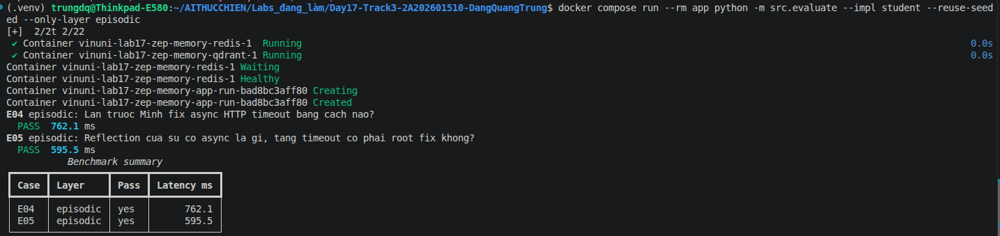
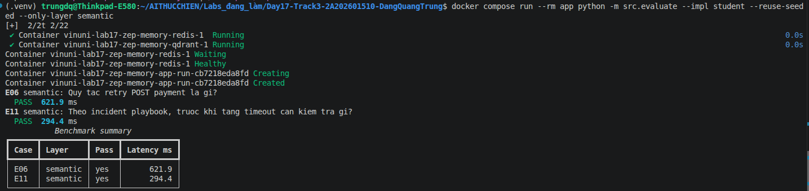
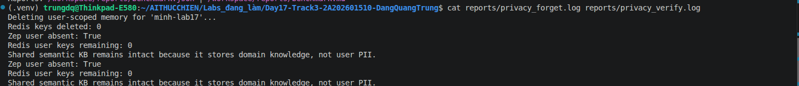

# Lab 17 - Multi-Memory Agent voi Zep

**Ket qua:** 11/11 PASS, hit rate 100%. Baseline no-memory: 2/11 (18.2%).
Nguon: `reports/benchmark.md`, `reports/comparison.md`.

## 3 cau thuc hanh

**Layer quan trong nhat trong bo test nay: long-term.** No quyet dinh truc tiep 4 case — E02
(preference Python), E03 (open loop `benchmark report` / `16:00`), E08 (recency BLUEBIRD-42), E09
(isolation LOTUS-88) — va la mot nua cua E07. Bo long-term thi mat 5/11 case.

**Trade-off Context Block (Zep) vs Redis+Qdrant.** Zep lo extraction, scope theo user, validity
range va cross-session recall nen code retrieval rat ngan; doi lai ingestion bat dong bo, latency
cao nhat lab (long-term ~1650 ms), va context block la ban da tom tat nen de mat marker literal —
phai append `graph.search(scope="edges")` moi giu duoc `16:00`. Redis+Qdrant nhanh, re hon, nhung
phai tu viet extraction, conflict resolution va isolation.

**Guardrail chong memory poisoning.** (1) Consent gate: `require_memory_consent`, khong opt-in thi
`PermissionError`; kem `minimize_pii` khi ghi. (2) Scope theo `user_id` — E09 chung Lan khong doc
duoc `ORCHID-27` cua Minh. (3) Giu `valid_at`/`invalid_at` de fact moi ghi de fact cu theo scope.

## 4 cau phan tich benchmark

1. **Hit rate thap nhat:** khong co — ca 4 layer deu 100% (short 2/2, long 4/4, episodic 2/2,
   semantic 2/2, mixed 1/1). Layer "dat" nhat la long-term: ~1258 token, ~1650 ms trung binh.
2. **Retrieve nhieu token nhat:** E08 (~1412 token, xap xi E02/E03 ~1410) — ca 3 deu long-term, vi
   context block cong 20 edge facts.
3. **E07 = long-term + semantic.** Evidence bat buoc: `Python` (long-term) va `Idempotency-Key`
   (semantic graph). Budget cat long-term tu ~1417 xuong 324 token ma van giu du 2 marker.
4. **Token reduction khong thay hit rate.** No-memory dat 81.8% reduction nhung chi 18.2% hit rate:
   khong retrieve gi thi re nhat va sai nhat. Ban memory chi giam 14.2%.

## E08 recency va E10 compaction

E08: sau stage 3, edge facts moi khang dinh BLUEBIRD-42 dung TypeScript/NestJS va "Python is not
to be used for the backend", trong khi preference Python cho ORCHID-27 van con — recency thang
theo scope chu khong xoa fact cu.

E10: sliding chay 8 lan compaction, chi giu 6 luot gan nhat, nhung durable notes van cuu
`REVIEW-DEADLINE-1600` / `Friday` / `16:00` trong 195 token.

## Bang chung

Long-term (E02/E03/E08):

Episodic (E04/E05):

Semantic (E06/E11):

Privacy drill:

